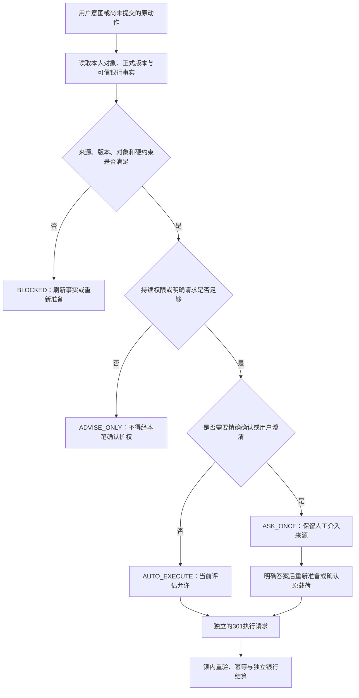

# 四级自主决策评估

MVP-302 实现说明；当前验收状态见[任务进度](../progress/MVP-302.md)，判定口径见[ADR0010](../adr/0010-evidence-bound-autonomy-levels.md)。全部账户和银行事实为本地合成模拟。

| 请求 | 输入与行为 |
|---|---|
| `POST /api/v1/actions/assess` | 仅接收 `{"intent": {...}}`，意图结构与[准备动作](execution-api.md)相同；读取可信事实后评估，不保存或执行动作 |
| `GET /api/v1/actions/{id}/autonomy` | 评估本人原有、尚未提交的动作，保留原经济载荷和策略版本；不会更新授权或确认 |

请求不接受客户端用户身份、时钟、等级、授权结论、余额、候选世界或来源摘要；未知字段和查询参数返回422。其他用户或不存在的对象返回404。已提交、结果未知或已有银行操作的原动作返回409 `NO_RECLASSIFICATION_AFTER_ACCEPTANCE`，应继续读取原动作和回执，不能重新分级后再支付。

返回 `simulation=true`、`status=ASSESSED`、服务端 `as_of`、来源引用、输入摘要和 `decision`。`evaluation_only=true` 表示此响应只解释当前判断；`execution_eligible` 也不构成可提交银行的授权凭证。

| 等级 | 含义 | 后续动作 |
|---|---|---|
| `AUTO_EXECUTE` | 当前正式权限、来源、对象和财务检查均满足，无额外确认条件 | 仍须准备动作并经执行器锁内重新检查 |
| `ASK_ONCE` | 精确金额、本人划转或费用损失需要确认，或有限用户变量改变动作 | 确认确定载荷；有歧义时先回答再重新准备 |
| `ADVISE_ONLY` | 事实明确但缺少允许执行的持续权限 | 修改并确认策略后重新评估；本笔确认不能扩权 |
| `BLOCKED` | 来源不可信、旧版本、硬财务约束、未知收款身份或不支持的动作等 | 按具体原因补齐可信事实或重新准备 |

`financial_evaluation` 区分 `VERIFIED`、`NOT_EVALUATED` 和 `REJECTED`。例如完整的已暂停策略可形成修改策略建议，但没有可执行载荷和已验证金额，必须标记 `NOT_EVALUATED`。证据不足时不能用“建议”或“请确认”掩盖问题。

确认只绑定原用户、动作、精确 `effect_hash` 和有效期。合法确认后该笔仍是 `ASK_ONCE`，`confirmation_satisfied=true`；只有当前重验也允许时，`execution_eligible` 才为true。这样保留人工介入来源，不把确认过的动作记作无人介入的自动执行。15分钟窗口过期或策略换版仍会阻断未受理动作。

本人划转的即时请求不创建持续策略。服务核对本人两账户和银行来源，把具体意图绑定到待确认载荷；账户证明仅证明对象与资金事实，不代表用户已确认划转。

内部 `assess_transfer_preferences` 支持一个 `amount_cents` 用户偏好变量，2至8个明确且不重复的正整数分候选。同一对本人现金账户、服务器时间和完整银行/业务上下文分别运行确定性检查。服务在同库独立只读REPEATABLE READ事务中读取全部候选的已提交事实，不提交或回滚调用方事务，不采用调用方未提交数据。候选顺序不改变结果；来源摘要覆盖实际事实，不能只比较证据ID。此函数没有HTTP候选世界入口。

经济签名比较金额、账户、归属、产品及版本、原仓位、费用损失、净额、来源片段和到账/退出约束，忽略随机操作标识及纯展示字段。该签名只用于候选比较，不能替代用户确认的完整载荷摘要。安全性或动作分歧会要求澄清并关闭执行资格；缺失银行事实、旧权限或跨用户等根本问题仍阻断。不能从一组候选中擅自挑选单个金额执行。

本项不新增数据表或迁移，不改写策略、账户、银行操作、预留或回执。完整决策轨迹、审计哈希链、业务界面和FULL多轮不确定性工作流按后续任务实施。

## 评估与执行关系

图中的评估节点均不写资金。候选分歧没有单个执行载荷；已确认的ASK仍保持ASK。具体财务状态和只读建议范围以本页字段说明及[服务说明](autonomy-service.md)为准。
