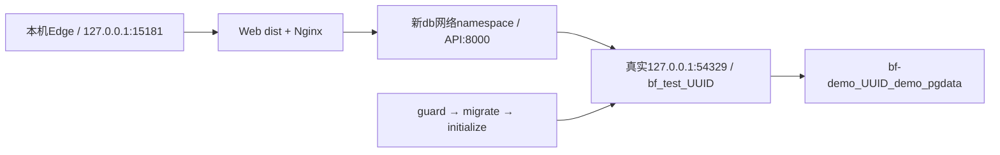

# 初版本地隔离部署包装与离线验收边界

当前状态：**CONFIG_RENDERED / BUILD_NOT_RUN / DEPLOYMENT_NOT_RUN / OFFLINE_NOT_VERIFIED**。本次交付4服务 Compose、Linux Dockerfile、同源代理和构建忽略规则；没有创建项目/卷/数据库、启动/seed/build/pull/load容器或运行浏览器/全量。MVP-504 保持开放。原根 `docker-compose.yml`、正式卷、原54329/8000/5173与W1的18047/15179不改；禁止LibreOffice。

原初版要求源：根 `钱途有界_初版开发计划_Codex执行版.md` 第833—836行（完整Compose、备用录屏、断网三黄金链）、第1038—1043行（完整预录、本地离线、可重置、同RunID截图/录像）。设计前置为 `.runtime/W1-504-compose-deployment-plan.md`；本文是该计划的部署文件差量，不能用静态渲染关闭原验收。

## 实际新增包装

| 文件 | 已实现能力 / 限制 |
|---|---|
| `deploy/compose.demo.yaml` | 独立 `bf-demo_UUID` 项目，db/init/api/web；独立project-scoped `demo_pgdata`，不接外部卷，不发布PG宿主端口；每服务pull_policy=never。真实运行仍待构建/原件 |
| `deploy/api.Dockerfile` | 同digest参数的Linux Python3.12依赖/运行stage；uv使用原uv.lock frozen、实际lock SHA、无dev依赖；PYTHONPATH与原root路径一致；API/init共用镜像，原seed/RPC与root-owned initializer入镜像 |
| `deploy/web.Dockerfile` | Linux Node24、原pnpm11.19.0、原lock SHA/frozen安装，保留allowBuilds和contracts/完整Web类型检查输入；实际tsc+Vite构建后仅dist进入Nginx runtime，VITE_API_BASE_URL为空 |
| `deploy/nginx.conf` | 同源 `/api/` 到新db namespace的API:8000，无URI后缀保留原/api/v1；proxy_next_upstream=off防代理透明重放；600秒read/send timeout仅是包装配置，不是性能达标 |
| `.dockerignore` | 根build context排除宿主.env/.git/.runtime/原证据/Windowsvenv/node_modules/store/cache/PGdata/媒体；没有copy宿主依赖、正式dump或凭据到Linux镜像 |
| `deploy/.dockerignore` | 登记deploy-local context的排除规则；当前context是`..`，Docker实际使用根`.dockerignore`，不能假称deploy该文件保护了根context |
| `deploy/initialize_demo.py`（root独占） | 包装直接调用原入口；真实DSN守护先于migration。全新全空业务库原seed一次，非空库验证原demo/OPENepoch/audit后保留原历史；本子任务未修改、未运行该金融initializer |

源规则与容器路径：API在 `/workspace`，`apps/api/app` 与原 `alembic.ini`/迁移相对位置保留；初始化command仅 `python deploy/initialize_demo.py`，没有外加先行migration绕过DSN守护。API进程使用原 `app.main:app`。Web构建完整src/tests/config与contracts，避免仅复制生产src导致原 `tsc --noEmit` 所需测试类型或schema缺失。

Docker从context根读取`.dockerignore`；只有形如`api.Dockerfile.dockerignore`的专用命名才覆盖根规则，当前没有这种专用文件。[Docker build context](https://docs.docker.com/build/concepts/context/#dockerignore-files)

## 实际loopback拓扑



db内部监听54329，API与init均 `network_mode: service:db`，因此原ScenarioRunner所见实际engine仍是127.0.0.1:54329与`bf_test_<32hex>`；没有放宽原guard或把`db:5432`谎称loopback。namespace拥有者db映射 **API8000→宿主18049**，PG54329不做宿主映射。Web共享新internal network，用`db:8000`同源代理；Web同时有自己的frontend network/127.0.0.1:15181映射。

Compose支持service网络namespace，此模式不能同时声明networks；API需db healthy且init成功结束后才启动，Web再等API健康。[Compose network_mode](https://docs.docker.com/reference/compose-file/services/#network_mode)、[启动依赖](https://docs.docker.com/reference/compose-file/services/#depends_on)。这支持设计与静态渲染，Docker Desktop namespace存活、db重建后API/init重新加入以及实际DNS/代理仍 **NOT_RUN**。

API健康检查严格读取原 `/api/v1/health` 模拟信封；这不是数据库业务ready或三链通过。实际启动后还须核新namespace内current_database/server_port、原当前epoch、完整23业务表+alembic元表、真实UI/dashboard。**仅db/API/init共享的namespace配置为internal，PG未发布宿主端口；Web同时连接普通demo_frontend bridge，其外网egress未受控。** 这不是整套Compose断网，更不是整机断网。pull_policy=never只限制镜像拉取，不能证明容器或浏览器没有外网请求。[Docker internal network](https://docs.docker.com/reference/compose-file/networks/#internal)

关于“Web只留internal网络且仍publish localhost端口”的候选：官方说明internal无默认外路由并过滤跨网流量，但仍允许host与容器IP及gateway/host服务通信；另一官方页说明普通internal bridge有host地址，gateway_mode=isolated才去掉它。这些说明**没有保证Docker Desktop上的internal-only容器能发布宿主localhost端口**，因此不能据文档直接改成并称离线可用。[network create internal](https://docs.docker.com/reference/cli/docker/network/create/#network-internal-mode---internal)、[port gateway modes](https://docs.docker.com/engine/network/port-publishing/#gateway-modes)

上游Moby有2018与2026的internal-only publish不可达原复现报告，2026记录29.6.2/Compose5.3.1；这是上游用户报告，不是本机实测或官方兼容承诺。需root在实际新项目先读取NetworkSettings.Ports、host HTTP、内部API访问和外部TCP/DNS探测，再决定是否只保留internal网络。[Moby原问题36174](https://github.com/moby/moby/issues/36174)、[近期原复现53256](https://github.com/moby/moby/discussions/53256)

同一风险也适用于db仅internal时配置的宿主API18049映射；它当前仅是配置意图，实际可能不发布。UI通过Web→内部db:8000、namespace内health和container-exec RPC不依赖宿主18049；协调器不能预设host API直连已可达。若internal-only Web实际不能publish，保留frontend时必须另取得该新项目的egress限制/失败探测及实际浏览器网络捕获，再对较窄离线条件报告；不能为修这一包装修改全机网络或放宽金融guard。

## root部署协调器必须补的输入与守护

当前没有在本包装新增自动start/stop/cleanup工具。root执行实际构建/部署前生成一个新owned-run，UUID严格小写32hex；同项目重启复用原登记，不再随机选库或原卷。必须在任何Docker写操作前校验下列输入；Compose变量插值本身只检查非空，不验证digest真实性/UUID/密码URL安全，不能当此守护已经实现。

| 变量 | 真实值 / 守护 |
|---|---|
| `BF_DEMO_UUID` | 新32hex UUID，派生project=`bf-demo-UUID`、db=`bf_test_UUID`；reject原project、名称/数据库已被其他run拥有及无owner重用 |
| `BF_DEMO_RUN_ID` | 实际新部署RunID，所有项目/网络/卷/命令/截图/录像/金融原件统一登记 |
| `BF_DEMO_PASSWORD` | 独立随机hex-only密码，避免在URL插值注入；不得复用原formal凭据、在公开manifest/stdout打印密码 |
| `BF_DEMO_POSTGRES_IMAGE` | 已本地准备的实际PostgreSQL16 image ID/immutable digest；宿主引擎必须Linux/amd64，read/inspect/manifest实核 |
| `BF_DEMO_API_IMAGE / BF_DEMO_WEB_IMAGE` | 本次真实构建或load的source-bound镜像，不是未验证标签；init与API完全同image |
| `BF_PYTHON_BASE_IMAGE / BF_UV_BINARY_IMAGE` | 实际digest-pinned Linux Python3.12基底、uv二进制镜像；两Python stage用相同基底。本机Windows uv0.12.9不证明Linux镜像同版本，构建日志须捕获实际uv版本 |
| `BF_NODE_BASE_IMAGE / BF_NGINX_BASE_IMAGE` | 实际digest-pinned Linux Node24与含Nginx/wget的Alpine runtime；不是默认latest。构建stage npm按明确pnpm@11.19.0安装、核实际版本；保留包artifact/integrity原件 |
| `BF_DEMO_SOURCE_HEAD / BF_DEMO_SOURCE_DIGEST` | 当前实际HEAD及包含dirty later成果、deploy、API/Web、脚本、合同/锁的全登记源摘要；不是Git HEAD单值或TOOL_ONLY占位字符串 |
| `BF_UV_LOCK_SHA256 / BF_PNPM_LOCK_SHA256` | 原锁bytes实际SHA，Dockerfile在安装前重核；locks/pyproject/packageManager不得为适配容器改版 |
| `BF_DEMO_API_PORT / BF_DEMO_WEB_PORT` | 默认18049/15181；实际执行前核空闲和排除54329/8000/5173/18047/15179，占用时新登记可用端口，不停止旧服务 |

协调器须显式 `--env-file 新独立私有env`，清除继承的COMPOSE_PROJECT_NAME/COMPOSE_FILE/相关BF变量，不混入根`.env`，不能用`-p bounded-funds`覆盖新项目，也不与根compose合并。真实输出只保存redacted config、实际project/volume/network owner与镜像ID/源hash。配置中DB密码是运行所需的显式环境变量，Docker inspect可见；此演示只模拟资金，仍应把原env留在私有路径且不进入公开证据包。

`initialize_demo.py`已存在，root会独立保存它的真实专项原件；包装不重复run seed、不在API entrypoint自动reset、没有down-v/清理正式资源。停止新项目应先核同owner记录，再用同compose/env执行stop并保留卷/日志；db容器重建必须重建共享namespace的API/init，实际连续性检查待执行。全库写、RPC/故障/可信时钟仍由root金融协调器独占，Web公共用户流没有新增金额、权限或trusted clock字段。

## 构建准备与离线运行需要分别证明

Python依赖stage按实际Linux平台执行 `uv sync --frozen --no-dev --no-install-project --no-editable`，关掉自动Python下载；只将该Linux生成venv复制到**同基底**runtime，宿主Windowsvenv不进入context。uv官方给出锁安装、同Python多stage和不复制宿主venv的模式；原锁存在不能保证缺网可安装。[uv Docker集成](https://docs.astral.sh/uv/guides/integration/docker/)、[uv环境变量](https://docs.astral.sh/uv/reference/environment/#uv_python_downloads)

Web按根声明固定pnpm11.19.0、Node24；完整lock保留Linux原生esbuild/oxide构建许可。最终Nginx没有Node/npm/pnpm/包下载动作，只使用dist与本地同源API。pnpm官方区分构建所需dev依赖与最终制品，支持frozen-lockfile；可在准备时单独准备Linux store/cache，Windows node_modules不能作为Linux安装结果。[pnpm Docker](https://pnpm.io/docker)、[pnpm安装](https://pnpm.io/installation)

本包装默认支持的离线目标是 **预构建镜像离线启动**。API与Web构建stage当前会请求依赖来源，构建准备必须由root另外取得实际原日志/退出、全部Linux包/artifact与镜像hash；本次没有离线源码重建能力的实证。若需要离线重建，还须准备各base/uv镜像、pnpm11.19.0本体/npm缓存、完整Linux pnpm store、完整Linux uv wheels/cache、build所需系统IANA时区与原生库；仅改加--offline不能制造这些依赖。API build已检查Python3.12与`ZoneInfo('Asia/Shanghai')`，真实缺时区会build失败，不能推测基底自带即通过。

实际离线启动只用已load且实核的三镜像（PG、API/init、Web），`pull_policy=never`加`--no-build --pull never`，缺本地镜像失败，不临时联网补齐；启动期间不需要uv/pnpm或registry。官方never只用本地缓存；image save/load是制品运输，不能替代真实链验收。[Compose pull_policy](https://docs.docker.com/reference/compose-file/services/#pull_policy)、[Docker image save](https://docs.docker.com/reference/cli/docker/image/save/)

Nginx无proxy_pass URI后缀，传递原请求URI；禁上游重试，无rewrite金融body；金额/UNKNOWN保持原API判定。[Nginx proxy_pass](https://nginx.org/en/docs/http/ngx_http_proxy_module.html#proxy_pass)。此配置还没有实际nginx -t/HTTP原bytes验证，不能称代理已工作。

## 可供root执行的命令接口（本次未执行写操作）

先由root可信协调器生成并校验新私有 `demo.env`/owner manifest、全部实际镜像与锁/源hash。下面的`ACTUAL_RUN`均是待替换的实际新路径，不能指向本次TOOL_ONLY渲染目录；不在本子任务运行这些build/up/save/load/stop命令。

```powershell
# 只读渲染：显式独立env，生成redacted公开副本
docker compose --env-file .runtime/ACTUAL_RUN/demo.env -f deploy/compose.demo.yaml config --format json
# 准备阶段：实际网络/镜像/依赖来源与退出必须另记
docker compose --env-file .runtime/ACTUAL_RUN/demo.env -f deploy/compose.demo.yaml build api web
# 离线运行阶段：已实核的本地镜像，禁止运行时构建/拉取
docker compose --env-file .runtime/ACTUAL_RUN/demo.env -f deploy/compose.demo.yaml up -d --no-build --pull never
docker compose --env-file .runtime/ACTUAL_RUN/demo.env -f deploy/compose.demo.yaml ps --format json
# 状态与日志需在same-run收录，实际新项目owner确认后才操作
docker compose --env-file .runtime/ACTUAL_RUN/demo.env -f deploy/compose.demo.yaml logs --no-color
```

实际先init完成才APIready，APIhealthy再Web；init失败必须阻断，不应靠重启或强行--no-deps跳过。真实重新启动须原23业务+alembic快照前后验证、原bank postings/receipt/audit/epoch保留。离线三黄金链须在新部署的实际Edge UI走原金融service/原授权路径，取得same-run原HTTP、完整bank/application/audit原件与独立oracle；新增收入后的自动分配、UNKNOWN不重复付、reset封存并新epoch均不能被省略。宿主W1浏览器旧coordinator会另建宿主库/服务，不能只改URL就称它验证本Compose；root需新增容器owner/namespace和container-exec只读snapshot/RPC transport adapter，保留原guard。

制品运输命令应由协调器用其真实三个image refs构造 `docker image save --output 新包.tar ...`，保存tar SHA与实际images.json；新机器实际load后重新inspect imageID/source labels/平台。保存原录屏工具/FFmpeg、真实240秒视频与备用完整录像、同RunID关键截图、结构化结果/审计/指标/PDF、离线浏览器请求和网络隔离原件。没有完整录像/真实时长或网络实测时相应项 MISSING/NOT_RUN。

## 本次真实只读验证与未覆盖项

原始manifest/输出在 `.runtime/W1-deploy-static-20261005T034418Z-c4b53fdb/`：

| 实际检查 | 原退出与结果 |
|---|---|
| docker version --format JSON | exit1；实际Windows客户端29.6.1/context desktop-linux可读，Server=null；LinuxEngine npipe permission denied；服务端版本未知 |
| docker compose version | exit0；实际v5.3.0 |
| docker image ls --format JSON | exit1；同engine权限拒绝；镜像库存、实际image ID/digest未知 |
| compose config --format json | exit0；显式TOOL_ONLY env且unbuilt image tags，不接DB/daemon、不构建；不是有效运行env/source digest或镜像来源证明 |
| 渲染结构重验 | 4服务、real namespace配置、bf_test目标、init完成依赖、internal网络、独立非external卷、pull never、宿主loopback仅API/Web端口、两build context确为repo根全部结构PASS |

Compose config是合并/插值/规范化模型的能力，不能据此证明Dockerfiles已被builder解析、Linux安装成功或服务已可达。[Docker compose config](https://docs.docker.com/reference/cli/docker/compose/config/)

本次引擎只读访问的permission denied是实际能力边界；未升权或修改Docker/Windows权限、未启动镜像。源Dockerfile只做包装/结构检查，Nginx parser与Linux构建实际未运行。本机uv0.12.9/Node24.14.1/pnpm11.19.0仅为宿主当前版本，不是容器Linux版本证明。

尚未覆盖：root部署owner/端口/镜像digest守护、容器真实构建与实际deps/时区、daemon/image库存、init容器fresh/幂等/失败阻断、shared namespace生命周期/HTTP代理、真实业务ready、旧正式历史只读before/after、同history重启、离线cold start/网络捕获、三黄金链/容器E2E/独立风险oracle、录像/240秒/备用完整视频/同RunID截图、完整材料与四命令闭合均 **NOT_RUN 或 MISSING**。现有专用host initializer专项结果须由root原件独立报告；这里不将它复制成容器成功。

这轮只交付可供实际构建验证的配置与源码包装。原全量验收仍保留初版节点，日常部署改动只选部署/init/代理与直接金融风险范围；未运行不补造成功。
