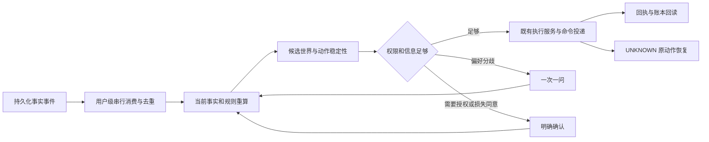

# 知余五能力扩展开发方案：保留现有 Demo

日期：2026-10-06  
状态：详细开发方案；本文交付时尚未启动扩展版实施。  
修订重点：模型 API 接入前置；按用户最新反馈，把授权内自动完成、必要事项一次确认、面向用户的结果展示作为首版交付标准。  
本次交付范围：只编写和更新本文档，不修改现有 Demo 源码、配置、数据库、进程或运行指针。  
实施原则：基于当前工程资产，在独立工作目录完成扩展，现有 Demo 继续保留。

## 1. 结论与交付目标

现有工程不是只有四页 Demo。十二类策略、生命周期、多目标规划、资产规划、有限候选世界、问题选择和部分实际执行链已经存在。扩展开发应当复用这些资产，重点补齐执行缺口、统一用户流程、增加持续调度及必要授权，并修复已知失败。

**先交付在授权内能自动完成一条资金主链的 Agent，再逐步补齐五能力。** 单独完成模型 API 配置、适配和真实连通检查，估计 2–4 小时。此前 6–12 小时的首版口径仅包含对话和既有确认执行接线；根据用户对过度确认的反馈，首版改为同时包含单目标最小持续消费、取消多余确认和隐藏技术字段，累计估计 **8–16 小时**。从 X06 提前安排 2–4 小时实现该受限自动链，包含在总工时内。首版仍限定已有单目标能力，不冒充五能力全部完成。

完整扩展净开发与必要验证调整为 **36–60 小时；含约 25% 不确定性余量，按 45–75 小时安排，约 6–10 个八小时工作日**。首个 Agent 版本的工作包含在总量内，不额外相加。此前 45–72 小时是五能力执行闭环的整体估算，不是接入一个模型的时间；本次增加模型接入，同时后置非阻塞的深层性能优化、复用 Agent 页面与四页的公共交互，避免把新增工作简单叠加成更长的首版等待。

估算基于一名熟悉工程的开发者配合 Codex，不是必须连续运行这么久的机器时间，也不是原完整版全部 92 项的正式关闭承诺。首个 Agent 版本完成后，根据联合目标失败原因、模型实际兼容性和性能定位收窄剩余估算。

用户提出的五个方向均进入本次扩展目标：

| 方向 | 现有 Demo 主流程 | 扩展版完成后应有的行为 |
|---|---|---|
| 产品重心 | 看懂边界、确认规则、完成一笔安排、理解异常 | 在已确认授权内持续处理资金事件；明确显示自动执行、必要确认、暂停和异常恢复 |
| 策略能力 | 两个稳定模板，候选、确认、暂停或撤销 | 十二类模板统一配置、完整生命周期、候选发现、修改前影响预览和确认后回读 |
| 目标与规划 | 单目标、单来源、一笔实际模拟执行 | 多目标冲突、动态月储备、365 日预测、最小修复、当前周期联合实际模拟执行 |
| 资产能力 | 核心演示不依赖多资产 | 多资产配置、定存梯度、有损提前支取、实际到期后重新配置 |
| 人工介入算法 | 使用已有自主等级，允许明确确认 | 候选世界、完整动作稳定性、minimax 问题选择、一次一问，减少重复或不影响动作的问题 |

“实际执行”在本文始终指经过真实本地 API、PostgreSQL、模拟银行、账本和回执的模拟金融执行，不是真实资金交易。前端动画、预览结果和构造回执不能代替执行证据。

## 2. 本次检查依据与现有资产

### 2.1 证据口径

本方案依据 2026-10-06 对源码、进度文档、历史实际运行 manifest 与日志的只读检查制定。本次规划没有重新运行金融测试、浏览器场景或服务健康检查。

以下三种状态分别登记：

- **代码存在**：已经有实现，但可能尚未接入用户流程，或者仍有失败。
- **历史定向验证通过**：所列命令和当时源码范围通过，不自动等于当前全部源码通过。
- **扩展版待实现或待验证**：本文安排的工作，不能提前算作完成。

现有原任务编号、失败日志和正式验收状态全部保留。扩展版功能验收与原 FULL 任务关闭单独登记，不用一份扩展版演示记录批量关闭旧任务。

### 2.2 复用、缺口与处理方式

| 模块 | 已有资产 | 当前缺口或实际限制 | 本次处理 |
|---|---|---|---|
| Demo 基座 | 四页界面、独立 API 工厂、精确数据库隔离、服务端预置、规则与单目标执行、UNKNOWN 恢复 | 页面有意缩小范围；不能通过开放所有旧接口直接变成扩展版 | 保留旧入口；在新工作目录增加扩展入口和必要接口 |
| 模型接入 | `CandidateProvider`、`FullCandidateProvider` 协议、`rules/llm` 分支、候选 JSON 校验 | `get_candidate_provider()` 返回 None，FULL runtime 默认关闭；没有网络 Provider，也没有地址/模型/密钥配置入口 | 前置实际 Provider、配置与对话工具接线；不是只把开关改为 true |
| 持续运行 | 命令投递、outbox/inbox、尝试记录、原键恢复、通知恢复 worker | 现有问题 worker 不负责自动金融执行；部分 FULL 执行硬编码 ASK_ONCE 与 USER 确认 | 增加事件驱动调度与明确的持续授权，不模拟用户点击 |
| 十二类策略 | 全部模板模型、校验、生命周期、有限自然语言编译、部分模式发现、影响预览、已审阅变更确认服务 | 各界面分散；不同模板的影响预览覆盖不一致 | 统一入口和状态，补消费链，显示预览完整度 |
| 多目标 | 确定性分配、冲突与最小修复、联合计划、父子执行结构、迁移和 UI | 联合双子动作实际集成已有 FAILED；修复 API 当前主要暴露月上限调整 | 先定位失败，再接通确认、预留、顺序执行和修复字段 |
| 年度规划 | 长周期保护投影、未来收入规划、季节储备、动态目标模块 | 长期预测与当前实际执行要严格分开；不可把预测收入变成可用余额 | 统一 365 日展示与滚动重算，当期执行继续受当前事实约束 |
| 多资产与梯度 | 资产分配、产品目录及版本、整笔计划和顺序批执行、购买执行链 | 枚举中的产品类别不等于已有完整产品条款与执行证明 | 按明确支持的产品和条款逐类接通 |
| 提前支取 | 早期模块存在有损支取相关资产；FULL 回收链有报价和原件校验 | 当前 FULL 专用消费链主要允许零费用、零损失；有损不能直接解除保护条件放行 | 补有损动作、报价、明确同意和账本分录适配 |
| 到期再配置 | 到期实际兑付已有定向通过；再规划服务已有 | 再规划仍为只读，尚未将审阅后的再配置决策完整绑定新执行 | 到账事实触发重算，以新授权和新动作执行再配置 |
| 少问问题 | 有限候选世界、经济效果签名、单步 minimax、持久化问题工作流 | 与目标、资产和持续运行主流程的接线不足 | 补有限适配器，保留当前版本失效与重算机制 |
| 前端整合 | 旧完整工程已有策略、年度、多目标、资产、一次一问等组件 | 旧 App 集成庞大，操作锁和恢复定位跨多类动作 | 选择性复用组件，统一四页和操作状态，不整页照搬 |

### 2.3 必须纳入排期的已知问题

1. **联合目标实际执行有已知失败。** W3 记录 `20261006T054143Z-a502381f` 为 FAILED；预览 HTTP 成功，但业务状态为 UNKNOWN，测试预期 READY_TO_REVIEW，尚未完成所需双子动作执行链。不能将此项标为“仅缺 UI”。检查未找到可替代该场景的后续同口径通过证据；根因需要在独立环境定位。
2. **到期兑付的通过不等于到期再配置通过。** W4 记录 `20261006T050709Z-2c401159` 为 PASSED，证明的是指定整笔、零成本、USER/ASK 模拟到期链及原键恢复等断言；不自动覆盖批量、有损和自动再投资。
3. **已审阅的策略变更确认已经有实现。** 应复用 `full_policy_reviewed_change.py` 并检查接线，不按旧缺口清单重新开发同一服务。
4. **现有 Demo 性能仍有缺口。** 已记录首次访问 3.46 秒，成功结果可见约 37–43 秒；执行后整页 state 读取约 19.7–21.7 秒。单目标 preview 在所列十次样本中均小于 1 秒。扩展前必须定位重读与重复核验开销。
5. **当前工作树包含大量未提交成果。** Demo 记录的 HEAD 为 `4ccf84e973978482a1098d18c69fbfc9f011fac6`。仅从该 HEAD 新建工作树，不能假定获得当前 Demo 和 FULL 代码；应基于实际工作目录中的有效源码建立独立快照。
6. **模型接入目前只有接口预留，没有实际实现。** `DatabaseSettings.llm_enabled` 默认为 False；MVP Provider 依赖返回 None；FULL 编译运行时没有网络实现。并且 FULL 模型候选目前必须与离线原句解析结果一致，接上网络也不会自动获得自由自然语言理解能力，需同时打通候选审阅与缺失字段补问。
7. **自主等级没有完整落实为用户体验。** `ZhiyuApp.tsx` 对 AUTO_EXECUTE 和 ASK_ONCE 共用勾选及执行门；`perform()` 每次会清空动作勾选状态，确认与执行仍是用户分步操作。候选区域复用通用 `ConfigurationReview`，可能显示最低/目标/最高月金额、重要程度、关联策略编号等完整字段。前两项属于交互和编排问题；后一项应按用户需要筛选展示，不能通过“已有 schema 就全部展示”决定产品界面。

## 3. 不影响现有 Demo 的隔离方案

### 3.1 保护对象

实施时首先复核下表。这里记录的是已有文档中的状态，不是本次重新探测后的运行承诺。

| 对象 | 现有记录 | 保护要求 |
|---|---|---|
| 源码工作目录 | `F:\学校活动\工行杯\钱途有界\bounded-funds` | 扩展实施不在此目录修改源代码、锁文件、依赖和启动配置 |
| 试用页面 | `http://127.0.0.1:19179/zhiyu.html` | 保留原入口和浏览器会话 |
| 当前轮次 | `20261006T073008Z-9e4333a75fb649b2b39b440f67590090` | 不切换、不覆盖原轮次指针 |
| 数据库 | `bf_test_9e4333a75fb649b2b39b440f67590090` | 不迁移、不 seed、不 reset，不作为扩展测试库 |
| epoch | `077e5bab-69a9-4950-bbe5-5f5ef531a4c7` | 不复用为扩展版环境身份 |
| 当前 API/Web | 19006 / 19179 | 不占用、不停止、不重启 |
| 其他保留轮次 | API 19000–19006；Web 19173–19179 | 保留全部服务、数据库、原件和未决定位信息 |
| 历史记录 | `docs/progress/ZY-DEMO.md`、`.runtime/zhiyu/` 等 | 不由扩展脚本改写、清理或迁移 |

禁止在现有 Demo 目录运行会启动、迁移、重置或写入其环境的 `make dev`、`make seed`、`make demo-reset`、扩展 worker 和新迁移。不能为了空出端口或资源而结束旧服务。

### 3.2 独立源码工作目录

推荐扩展目录：`F:\学校活动\工行杯\钱途有界\bounded-funds-next`。该名称为计划值，本文交付时未创建；实施时再次核对目标不存在且不是他人工作目录。

建立方式：

1. 只读列出当前工作目录中本次需要的源码、迁移、测试、依赖声明、锁文件、构建配置和规范文件；包含有效的已修改文件及未跟踪源文件。
2. 复制这些文件形成一次独立基线，记录来源 HEAD、实际文件清单与必要哈希。复制前后比较所选源文件，避免取得正在变化的一半版本；发现变化只重取相关文件。若连续变化，暂停本次快照建立，不能锁住或中断主线程。
3. 排除 `.git`、`.venv`、`node_modules`、构建产物、浏览器配置、运行目录、数据库文件、缓存及含凭据的环境文件。需要引用的历史证据保留来源路径，无需反复复制整套证据仓库。
4. 在新目录独立初始化版本管理和运行依赖；不提交、重置、暂存或清理原仓库。新目录中建立可复核的源码基线后再实施功能。
5. 不使用指向原源码、原依赖或原运行目录的可写符号链接、junction 或硬链接。包下载缓存可以只读复用，安装目标、虚拟环境和构建输出必须独立。

也可以使用受管理的新工作树，但必须显式补入当前有效工作目录快照，并证明未遗漏未提交资产。为降低本次实施复杂度，优先采用独立目录快照，不要求先整理原仓库的大量既有修改。

### 3.3 运行隔离

| 层级 | 扩展版要求 | 防止的影响 |
|---|---|---|
| Web | 新入口、独立 Vite 配置和输出目录，标题显示“知余扩展版 · 开发验证” | 旧页面热更新、产物覆盖和误操作 |
| API | 新应用工厂、显式接口白名单、独立进程 | 放宽旧 Demo 的高级接口限制 |
| 端口 | 建议 API 19200、Web 19273；使用前检查，不空闲即另选并记录 | 端口抢占；这些端口尚未检查或预留 |
| 数据库 | 新随机 `bf_test_<uuid>`、新低权限角色、明确环境标识 | 新迁移或测试写入现有库 |
| 数据库连接 | 保留精确名称、角色、模拟模式及回环地址校验；共享现有实例时仍核对 54329 | 仅凭模糊库名前缀启动 |
| 运行目录 | 新目录中的 `.runtime/zhiyu-next/`，独立 current 指针、日志、PID 和私有环境文件 | 改写原 `.runtime/zhiyu/current.txt` |
| 进程 | 记录 PID、启动时间、命令行、工作目录和环境身份 | 按进程名批量停止所有 Python/Node |
| 浏览器 | 新 origin 与存储命名空间，恢复记录绑定环境、epoch、用户和动作 | 把旧 UNKNOWN 动作拿到新库恢复 |
| Worker | 默认关闭；仅在新环境显式启动，环境身份不匹配立即拒绝 | 在 Demo 库持续消费或执行资金 |

现有 `scripts/zhiyu_demo.py` 的 ROOT 和运行指针绑定当前源码目录。扩展包装应在新目录中单独实现；不能把在旧目录执行它、仅换两个端口当作完整隔离。

配置和调度标识需要同时区分“模拟金融环境”和“扩展版环境”，不能只依赖 UI 名称。敏感凭据只保存在新目录中被忽略的私有配置，不写入本方案、公开日志或交接摘要。

### 3.4 同机资源影响

不同数据库仍可能共享 PostgreSQL、CPU、内存和磁盘。代码与数据隔离不能保证同机重负载对演示时延绝对没有影响。

默认采用一条慢金融链顺序验证；worker 低频唤醒、限制批量与并发，稳定无变化时不持续重算。演示使用期间不运行重型集成、全量构建、数据库维护或压力测试。遇到资源争用，首先暂停扩展版任务，不干预现有 Demo。

如果要求在扩展版重型测试期间，现有 Demo 的运行时延也完全不受影响，应将扩展服务和数据库放到独立主机或独立计算环境；该部署工作另行估时，未包含在默认 45–75 小时中。

### 3.5 保护验收与回退

- 开发前只读记录现有入口、进程身份、运行指针和涉及的源码清单；现有记录中出现变化时先辨明是否来自主线程，不据此自动恢复文件。
- 旧 Demo 的三场景回归在**新目录的另一个专属测试库**中运行原 Demo 入口，验证共享代码兼容性；不拿现有试用库开展新金融测试。
- 扩展版交付使用新 URL，现有 Demo 继续使用原 URL。扩展版验收通过不触发自动覆盖、原地升级或旧服务回收。
- 停用扩展版时先暂停新的金融动作；若有 UNKNOWN，保留数据库、原动作和可用查询/恢复入口，不能通过删库或换轮次消除未决状态。
- 清理只针对本次确切创建且已记录的对象，另行按需求执行。不得自动删除旧服务、旧库或失败证据，也不做数据库降级来撤销已发生的模拟经济效果。
- 如误改原目录，立即停止扩展写操作，核对本次实际修改和原线程变化；只修复已确认由本次造成的内容，禁止 `git reset --hard` 或批量 checkout 回滚。

## 4. 功能范围与共同约束

### 4.1 本轮覆盖范围

| 维度 | 本轮实现口径 |
|---|---|
| 用户及账户 | 单个演示用户，使用服务器可信账户与事实；保留工行体系内模拟边界 |
| 模型/API | 实际外部模型 Provider、地址/模型名/密钥配置、连通检查、自然语言候选与解释；离线入口继续可用 |
| 策略 | 十二类模板；每类具备真实业务语义和必要消费链，不能只做十二张静态卡片 |
| 多目标 | 首轮明确支持 2–8 个共同规划和当前周期联合执行的目标；更大目标集不静默截断 |
| 365 日 | 全年保护、缺口和目标预测，事实或规则变化后滚动重算；只对当前可执行部分产生动作 |
| 资产 | 在服务器提供完整模拟条款的产品集合内完成配置、梯度、提前支取及到期再配置 |
| 自动化 | 已支持动作族在明确持续授权内自动执行；越权、证据不足、损失或实质性偏好分歧进入相应处理 |
| 少问问题 | 有限离散候选世界和确定性选择；保留上限与 UNKNOWN，超出支持范围时明确说明 |
| 执行真实性 | 实际 API、数据库、模拟银行与账本贯通，幂等、守恒、原键恢复保持成立 |

不在本轮加入：真实银行或跨行接入、同时深度适配多家模型的全部特性、无限候选世界、连续随机优化、365 日所有未来动作一次性全局最优执行、实验平台扩建、完整故障矩阵研究、原 92 项全部正式关闭。首轮完成一个实际可用模型提供方及必要的协议适配，通用配置不等于所有厂商已实测。

365 日规划仍是完整的年度预测和滚动决策能力；避免将未发生的一整年交易预先锁定。若后续需要全年度多阶段全局最优求解，应作为单独优化项目重新评估。

### 4.2 金融与权限约束

1. 金额使用整数分；不得由前端或 LLM 计算最终安全额度。
2. 候选、预测、用户回答与执行授权分别保存，不能相互替代。
3. 未到账收入只影响预测情景，不扩大今天可执行资金。
4. 执行准备与接受前复核现行策略、授权、产品条款、资金、目标归属和源版本。
5. 权限撤销、暂停或过期阻止新的授权接受；已经可能产生经济效果的原动作仍须查询和对账。
6. 事件可以重复送达，经济效果至多一次；不能因为超时换新银行操作键。
7. UNKNOWN 不能显示为失败、成功或已回滚；阻止相互冲突的新动作及联合计划后续子动作。
8. 保存原始报价、授权、命令、银行结果和账本证据；不修改历史哈希来迁就新协议。
9. 查询接口保持只读。性能优化不能跳过原件核验，不能跨请求缓存权限结论。
10. 服务器拥有实际金额、时钟、到账事实、产品事实和回执。演示通过服务器预置意图触发，不允许客户端伪造上述事实。

### 4.3 Agent 与 API 接入设计：首个交付阶段

目前有后端业务 API，也有模型候选协议预留，但没有实际外部模型网络适配；准确定位是规则驱动的资金执行 Demo，尚未完成用户预期的模型 Agent 层。上一版将外部模型排除在范围外的取舍在本修订中取消。

产品由三个配合的部分构成：模型理解自然语言、生成候选和解释；确定性业务工具负责规划、边界和执行；持久化调度负责事件、状态和持续运行。接模型能让已有业务能力更容易被使用，但不会自动补出多目标、有损支取或到期再配置中尚未完成的执行逻辑。

#### 4.3.1 用户实际获得的接入口

扩展版提供“模型设置”入口或等价的本地私有配置，至少包含：

| 配置项 | 行为 |
|---|---|
| 服务地址 / Base URL | 后端使用操作者配置的模型服务地址；不得从对话文本动态决定请求地址 |
| 模型名称 | 明确使用哪个模型，不在代码中写死为唯一云端型号 |
| API Key | 仅存扩展版后端私有配置；页面只显示已配置及掩码，不写入前端包、普通日志或对话 |
| 启用/关闭 | 只作用于扩展版，不修改旧 Demo 的 LLM 开关 |
| 测试连接 | 使用固定非金融探测输入，返回连接、认证和协议解析状态；不产生资金动作 |
| 超时和调用上限 | 配置网络超时、单轮有限调用数及失败停止条件，避免无限循环 |

建议扩展配置名为 `LLM_ENABLED`、`LLM_BASE_URL`、`LLM_MODEL`、`LLM_API_KEY`、`LLM_TIMEOUT_SECONDS`。以上是待实现配置，不表示现有程序已经能读取这些新字段。密钥由用户在本地私有入口填写，不要求贴到聊天记录。

Provider 层承接现有 `propose(text, context)` 协议，并按选定服务的真实请求/响应协议实现。首轮可优先采用兼容 OpenAI 风格接口的适配器，但必须实测选定提供方的 JSON 或工具调用能力，不把“兼容”作为全功能保证。

本文交付时未指定模型服务、未提供凭据、未发起外部调用。适配和页面可先开发；真实连通验收依赖届时可用的地址、模型及凭据，等待外部配置不计入有效开发工时。

#### 4.3.2 Agent 首版能做什么

首轮复用现有单目标和规则链，完成下面的一条完整交互：

1. 用户描述需求，例如“留出三千元应急金，剩下的钱按我的旅行目标安排”。
2. 模型生成结构化候选；缺失金额、日期或明确范围时询问，已明确字段保留原文来源。
3. 后端校验候选并调用真实状态和规划工具，返回保护额、可安排额及需要确认的事项。
4. 页面用自然语言和少量关键业务字段呈现候选与影响；首次创建权限时点击一次“确认并开启自动安排”。已有授权覆盖的后续动作无需再次确认；必要动作只使用一个明确确认按钮，不要求额外勾选。
5. 既有执行服务完成实际模拟资金链；Agent 根据真实结果解释成功、拒绝或 UNKNOWN。
6. 用户追问“为什么只安排这些”“这笔现在怎么样”时，Agent 查询当前原动作状态再回答，不按聊天记忆编造结果。

这是可操作的 Agent 入口，不是一个只回答理财常识的聊天框。X06 的单目标最小事件消费和暂停能力提前接入首版，证明授权后的重复同类事项自动完成；其他动作族在相应执行链验证后逐项接入。

#### 4.3.3 工具与确认边界

首轮提供受控工具适配，建议包括当前资金摘要、现行策略、规则候选预览、已有单目标规划、原动作查询和结果解释。工具名称由服务器注册，参数经过类型与范围校验，返回对象引用及源版本。

模型可以帮助解析用户指令、选择对应的查询/候选入口并解释返回结果；最终金额、权限、策略生效和资金动作由确定性服务决定。模型返回“用户已经同意”不构成 USER 确认；模型工具不能获得任意数据库、文件或银行调用能力。

首版使用有限轮数的工具循环和现有状态服务即可，不先引入多 Agent 框架、向量数据库或长记忆平台。持久化必要的会话、候选引用和结果引用，不复制一套金融状态。

#### 4.3.4 自然语言能力不能只打开开关

现有 FULL 候选服务会拒绝离线规则未完整解析的内容。接入后需要区分“模型建议字段”和“用户已声明且可核对的字段”：

- 模型结果先进入可审阅候选，不直接调用生效或执行接口。
- 已明确的金额、日期和范围保留来源片段，单位、引用和 schema 由确定性代码校验。
- 未明确或存在歧义的字段生成问题，不让模型擅自补全为授权事实。
- 对离线语法无法解析的表达，通过自然语言补问或只含必要业务字段的卡片取得明确输入，再走原确认链；完整结构化对象保留在后端，不要求用户阅读协议。不得删除原有校验直接放行模型输出。
- 模型不可用时显示真实错误，允许使用保留的离线模板/表单；不能把离线回退说成模型调用成功。

#### 4.3.5 首版最小验证与工时

模型配置、网络适配和连通检查约 2–4 小时；薄对话入口、工具接线及简化审阅约 2–4 小时；独立环境约 1–2 小时；最小单目标自动消费与暂停约 2–4 小时；复用已有主链的必要定向验证约 1–2 小时。累计 **8–16 小时**，分别计入 X00、X-AI、X06 的前置部分和 X08，后续不重复计算。首版自动消费只开放既有单目标安全动作，复杂资产和联合动作等待其本身验证。

至少验证一次真实模型连通、一个候选到实际模拟执行主流程，以及模型超时、非法 JSON、虚构金额/授权不被采纳。供应商网络调用不参加每次常规回归；确定性夹具覆盖多数分支，但夹具不能代替首次真实连通证明。

### 4.4 产品体验纠偏：以用户最新反馈为首版验收要求

用户明确指出：确认过多、勾选后再确认、命令提交后暴露后端结构化内容，以及与预先产品构想存在其他偏差。本节规定交互与自主行为；优先于本文其他章节中“复用已有流程”可能被误解成原样保留旧 UI 的描述。

#### 4.4.1 自主权落实为行为

不以模型主观判断“事情不严重”为依据，也不把所有动作默认交回用户。将用户一次确认的范围落实为可执行权限：允许的动作、来源和目的地、单笔/周期额度、保护底线、期限、费用/损失条件及有效期。用户可查看、缩小或暂停。

| 情况 | 应有行为 | 用户额外操作 |
|---|---|---|
| 已授权、事实齐全、动作稳定、额度和产品条件均满足 | 后端自动重检并执行；完成后更新活动和简短结果 | 每笔零确认，不弹确认框 |
| 首次授权或扩大资金、用途、期限等权限 | 给出简短范围与后果摘要，一次明确确认；可将确认规则与开启该范围自动安排合并 | 一次按钮操作 |
| 出现尚未授权的费用/损失、付款关系或其他实质变化 | 说明具体新增后果，只确认该次需要新增的内容；保留既有不可豁免条件 | 一次有明确后果的确认 |
| 用户偏好缺失且会改变实际动作 | 从已有问题算法选出当前必要问题 | 一次一问，不先要求审阅整个配置对象 |
| 状态暂未返回、原动作 UNKNOWN | 后台按原 ID 查询/恢复，显示“正在核实”；只有确需用户补充信息时才升级为待办 | 通常无需反复手动查询，不重复发起资金动作 |
| 越过不可突破的保护底线或证据缺失 | 暂停相关动作并解释；可以提出合法修复或补充途径 | 不通过多点一个确认绕过限制 |

“自动审批”在本产品中实现为既有授权范围内的自动判断和执行，不意味着 Agent 给自己扩大权限。规则有效且范围足够时，不再每次向用户索要同一份许可。

#### 4.4.2 一次确认不等于勾选加多个按钮

- 普通规则确认使用一个“确认规则”或“确认并开启自动安排”按钮。单独的“我已阅读/我已确认”勾选框不作为默认前置。
- 必须逐笔确认的动作使用一个“确认并执行”按钮，页面呈现金额、对象、费用/损失等必要后果。点击时由服务器记录用户、当前候选/经济效果版本及同意，继续调用准备、确认和执行服务。
- 服务端可以有多个请求和状态阶段，用户不需要为每个后端阶段再点击一次。已确认且经济效果未变化时，不要求再勾选一次才能执行。
- 执行前如果金额、对象或损失等确认内容发生实质变化，展示变化后重新确认；后台重试、状态刷新及原动作查询本身不构成再次索取确认的理由。
- 暂停自动安排应一键生效，立即停止接受新动作，保留在途原动作核对。撤销需要说明后果时使用一次明确操作；去掉“先勾选接受暂停，再按暂停”的机械步骤。
- 复选框可用于真实的选项选择，例如哪些资产类别可用；不把它当成所有金融操作必备的确认仪式。

后端要求 `accepted=true` 和绑定的确认记录，不意味着界面必须让用户亲自点击一个 checkbox。按钮点击可生成相同的有效确认输入，同时保留服务端权限和源版本校验。对 AUTO_EXECUTE 的动作则无需制造额外的逐笔 USER 确认记录。

#### 4.4.3 前台显示人能理解的规则与结果

普通用户流程只展示：理解了什么、将怎么安排或已经安排什么、必要金额/日期/对象、为什么、当前是否需要用户处理。后端结构化对象继续用于校验、执行和审计，不直接作为对话回复或规则审阅页面。

示例文案（仅用于界面设计，不代表已发生交易）：

> 工资到账后，先保留你设定的应急金，再按旅行目标的月度上限安排。这个范围内由我自动处理。
>
> 已为旅行目标安排 1,000 元，应急金未受影响。你可以在活动记录查看详情或暂停后续安排。

具体金额必须取自服务器已验证的候选或结果，不能由模型自由补写。规则建立前展示真实授权范围和必要条件；“简洁”不能隐藏费用、损失或扩大权限。

JSON、DSL、请求体、内部属性名、完整 UUID、哈希、协议版本、源证据编号及通用配置中与当前决定无关的字段，不进入普通主流程。详细业务信息按需展开，原始技术信息只在明确的开发诊断入口提供。未识别错误码转换为可行动的中文提示，原错误保存在诊断日志。

#### 4.4.4 从命令到完成的用户旅程

1. 用户表达目标和允许系统处理的范围。
2. Agent 根据现有权限判断是直接处理、补一个关键问题，还是呈现一次授权摘要。
3. 规则建立、目标关联、计划生成和执行准备由后台串接；用户不负责逐步操作后端流程。
4. 在已授权范围内，真实到账事件驱动执行；普通界面不要求用户手工“注入收入”、选择 SAFE/RESPONSE_LOSS 或打开技术会话。
5. 前台持续呈现简短进度和真实结果，只有必要选择或新授权才出现待办。
6. 用户能一键暂停并查看规则、已发生安排和当前未决事项。

收入注入、故障注入和场景选择仍可保留在隔离的演示控制入口，方便证明真实模拟链；它们不属于普通用户日常操作。

其他尚未具体描述的预期差异不声称已全部解决。实施前围绕以上用户旅程检查每个主页面及操作，记录“用户目的—触发—系统自动完成—必要介入—结果”，发现偏差就修正规格，而不按旧页面组件数量定义完成。

#### 4.4.5 首版体验验收

| 编号 | 可观察判据 |
|---|---|
| UX1 | 一次确认的范围覆盖两次不同到账事件时，两次均自动进入合法执行，不出现逐笔勾选/确认 |
| UX2 | 需要明确同意的一笔，在已呈现完整必要后果后只点一次“确认并执行”；页面刷新不重新索取相同确认 |
| UX3 | 普通对话、候选和结果中不出现原始 JSON、内部属性名、协议字段或要求用户理解的哈希/UUID |
| UX4 | 确认目标规则后由系统完成必要关联和准备，用户无需再手工创建同一目标、选择测试场景才能继续 |
| UX5 | 点击暂停立即停止接受新的自动动作，原已提交动作仍可核对 |
| UX6 | UNKNOWN 先由后台查询/恢复同一原动作；没有“为解决未知重新创建一笔”的用户路径 |
| UX7 | 模型不可用时准确提示，既有已授权确定性动作及原动作核对不依赖临时聊天回答 |

UX 判据复用第 13 节相关真实场景和前端状态检查，不另复制七套昂贵的端到端流程。UX1、UX2、UX3、UX5、UX6 是首版必须检查的核心，其他按实际接线一并验证，不能把这些产品问题推迟到五能力全部完成之后。

## 5. 功能一：持续自主安排资金

### 5.1 用户流程

用户通过一次明确操作确认规则和可自动处理的范围并开启“持续安排”。之后收入实际到账、保护规则变化、到期现金到账或周期切换触发重算。系统给出三种可理解的结果：已在授权内安排、等待必要信息或确认、当前无需动作。用户可随时一键暂停新的自动安排。

暂停后不再生成或接受新的金融动作；已接受且结果未明的动作继续核对。恢复时重新读取当前事实，不无条件补执行暂停期间积累的所有旧候选。

### 5.2 技术方案

计划复用 `command_delivery.py`、现有 outbox/inbox、银行操作幂等键和执行服务，不再创建第二套扣款器。增加薄调度层，主要负责：

- 事件类型：实际收入到账、策略版本生效、模拟周期到达、到期款实际入账、原动作结算、人工回答完成。
- 事件唯一键：环境、用户、事件种类、持久化来源 ID 和来源版本；禁止把 wall-clock 每次轮询时间作为金融动作唯一键。
- 同一用户或同一资金范围串行消费，配合数据库事务和已有锁，防止两次重算抢占相同可用资金。
- 保存消费进度、计划版本、原动作关联、等待原因、失败和重试状态，进程重启后从持久化状态续接。
- 重复通知只触发读取已有状态；源版本发生变化则重新规划，不能用新版本再次投递旧经济效果。
- 仅开放已完成接线和定向验收的动作族；未支持的候选显示原因，不通过通用反射或任意路由调用执行。

建议新增 worker 入口和一个 orchestration service；若现有事件/执行记录足以容纳状态就直接复用，否则仅补最少的事件与运行记录表。迁移编号必须检查新目录当前迁移头后确定，不提前占用原仓库编号。

### 5.3 持续授权

当前部分 FULL 执行必须走 ASK_ONCE 和 USER 确认。自动执行前必须建立显式的持续授权语义，不能把后台调用写成 USER，也不能自动点击原确认按钮。

持续授权至少绑定：用户、资金来源和目标范围、动作族、适用策略版本、单笔及周期上限、产品类别与最长锁定期、费用/损失边界、生效与失效条件。优先复用现有策略权限及自主等级，缺少的字段用新版本表达，旧版 ASK_ONCE 记录继续按原语义解释。

当所有候选世界产生相同经济动作且有效授权覆盖该动作时，才可自动接受。资产损失同意、跨目标资金释放和扩大权限按各自语义明确处理，不因“开启自动”而统一豁免。

验收：同一事实重复送达、服务重启和响应丢失都不产生第二次经济效果；暂停/撤销后不接受新动作，原 UNKNOWN 可用原键恢复；已授权稳定场景无需逐笔点击确认。

## 6. 功能二：十二类策略、生命周期、发现和影响预览

### 6.1 模板覆盖

| 模板 | 用户语义 | 扩展版最少应证明的行为 |
|---|---|---|
| RecurringObligationPolicy | 周期性刚性支出 | 在正确日期和范围保护资金；改变规则影响边界 |
| LivingReservePolicy | 日常生活储备 | 与周期和当前事实一起生成保护额，避免重复扣减 |
| EmergencyBufferPolicy | 应急金 | 保护底线不能被目标或资产分配侵占 |
| DatedExpensePolicy | 指定日期支出 | 到期前形成保护需求，版本变更可预览 |
| LongTermGoalPolicy | 长期目标 | 金额、截止日和储备约束进入目标计划 |
| PeriodicTransferPolicy | 周期转账 | 经有效权限在支持账户间触发到期动作；不重复执行同一周期 |
| AssetAuthorizationPolicy | 资产配置授权 | 产品、期限、风险和额度限制被真实执行重检 |
| RecoveryPolicy | 资金恢复规则 | 缺口触发恢复候选，受明确费用/损失和可回收性约束 |
| GoalAllocationPolicy | 多目标分配 | 当前安全新资金按明确规则分给多个目标 |
| CrossGoalReallocationPolicy | 跨目标再分配 | 释放和接收授权、原目标归属及总量守恒均有效 |
| SeasonalReservePolicy | 季节性储备 | 发现只生成候选，确认后才影响对应窗口保护 |
| InterventionPolicy | 人工介入规则 | 控制去重、节流和稳定时静默，必要授权/损失/风险问题不能被屏蔽 |

采用通用模板表单承载公共字段，按模板呈现必要专用字段；复用现有 schema，不为十二类模板各做一套重复页面。自然语言通过第 4.3 节的实际模型接入生成候选，保留离线有限编译和表单作为可明确识别的备用入口。

### 6.2 生命周期与版本

统一显示候选、待确认、生效、暂停、撤销、到期、被新版本替代等用户状态；具体状态与既有状态机逐项映射，不添加绕过原约束的快捷状态转换。

候选确认、修改确认、暂停、恢复、撤销均调用既有服务并独立回读。保存版本、操作者、来源、时间和关联影响预览。旧动作引用旧版本，不通过修改历史策略内容解释旧执行。

### 6.3 发现能力

复用现有周期和季节发现，从持久化交易事实提取有限模式；显示所依据的样本、区间和为什么提出此候选。去重后进入候选列表，支持确认和忽略。

样本不足时明确表示不足，不虚构规律；发现不会直接授予执行权限。先交付已存在且有证据来源的模式，不增加开放式商户推荐或消费评价。

### 6.4 影响预览

复用现有多模板影响预览和 `full_policy_reviewed_change.py`，统一展示修改前后：保护额、安全可安排额、目标当期分配、产品容量、恢复候选、已存在动作是否需要重算。

现有 PROJECTED、PARTIAL、UNKNOWN 等覆盖状态必须显式显示。预览不完整时列出未计算范围，不写“无影响”。对将要据此授予权限或接受执行的关键维度，缺失不能放行。

确认绑定源指纹、旧版本、候选版本和已审阅效果；源变化后重新预览。确认成功后读取实际策略及实际边界，与预览口径对照。

验收：十二类均完成配置校验与生命周期关键分支；保护、分配、转账、资产、恢复、跨目标和介入等不同消费族有真实接线证明，不用单一通用 schema 测试代替全部语义。

## 7. 功能三：多目标、动态月储备、365 日规划和最小修复

### 7.1 优先修复联合执行失败

在新环境复现 W3 失败，按数据输入、预览状态、保护投影、源指纹、计划大小和父子动作合同定位，记录实际原因。不得为得到 READY_TO_REVIEW 直接把 UNKNOWN 改名或减少必要校验。

先打通两个目标、不同金额、单一实际收入来源的最小实际链，然后扩展到明确支持的 2–8 目标。当前配置允许的目标数量与当前执行消费链上限并不一致，UI 和 API 必须暴露实际执行上限，不能允许创建后才静默丢弃目标。

### 7.2 统一目标规划

- 复用现有确定性 lexicographic 分配与固定排序规则，显示优先级、当期约束、实际归属、缺口及不能满足的原因。
- 动态月储备结合目标剩余金额、截止日、已归属资金、既有保护、月上下限和当期事实计算。避免把月储备、年度投影和执行预留三次重复计算为占款。
- 未来收入按预测情景显示，来源与确认状态清晰；当前执行资金仍只来自已到账事实和合法可用余额。
- 规则、收入、支出、目标归属、产品到期事实变化后重算，保留前后版本差异。

### 7.3 365 日展示

复用现有保护与联合规划时间轴，支持按月总览和按日查看，区分预测、保护要求、已安排和实际到账。后端保留必要完整时间信息，前端可聚合展示，但不能截断安全判断所需天数。

当前联合执行已有 365 日跨度的 1098 时间点结构及计划大小限制。先定位实际大小和查询开销；必要时对重复元数据做规范化引用和展示分页，不直接提高上限或截断证据来换取通过。

### 7.4 最小修复

复用现有修复候选排序和约束模型。对不可行方案提供在已允许协商字段内变化最小的候选，例如月上限、允许调整的月下限或截止日。当前 HTTP 暴露范围较窄，需要补与领域模型相匹配的请求、确认和 UI 接线。

每项修复显示修改字段、前后值、改善的目标和仍存在的缺口；经用户确认生成新目标/规则版本，再重新规划。不能直接更改目标或为了满足可行性侵占不可协商的应急底线。

### 7.5 当前周期实际执行

使用不可变父计划及子动作；按既有收入来源预留和归属机制控制总量。子动作依次执行，任一 UNKNOWN 阻止后续相关子动作；部分已成功时保持实际结果，不声称父计划整体回滚。

策略或事实变更后，已接受动作按原协议核对；尚未接受部分重新校验，必要时形成新计划且不重复使用已经消耗的收入。跨目标资金转移必须经过原目标释放及新目标接收授权。

验收：两个不同金额目标实际到账、资金总量守恒；冲突解释与最小修复确认后改变真实计划；未到账收入不增加今日可执行额；一个子动作 UNKNOWN 后不推进下一子动作。

## 8. 功能四：多资产、定存梯度、有损支取、到期再配置

### 8.1 产品与资产配置

从已有产品目录、版本化条款和资产分配器出发，先明确本轮支持的模拟产品矩阵。每类产品必须具有真实服务器条款、可买条件、到账时间、期限、收益/损失计算与回执能力。

优先覆盖已有 T+0、T+1 和固定期限资产；7/30/90 天等期限只有在目录和模拟执行提供相应条款后才开放。不能因为类型枚举中出现某类别就显示为可执行。

配置计划统一展示现金保护、可分配部分、各产品金额、锁定到期、收益假设和取回成本。金额由确定性规划器决定，并受当前目标用途、授权期限、可用性和上限约束。

### 8.2 定存梯度

复用梯度规划器和整笔顺序批执行，先提供有限档数、固定可解释规则的模板。每档使用实际产品版本，实际合同到期不得晚于用户授权的不可变购买期限。

展示各档本金、到期日与届时可用资金，购买后读取真实持仓和回执。某档未决时暂停后续冲突购买，保留已经成功的档位；不以新的整批订单代替原批次恢复。

### 8.3 有损提前支取

当前 FULL 回收链主要限制零费用、零损失，RecoveryPolicy 的相关上限也有零值约束。实施应显式增加有损分支或新版本，不修改旧版含义，不删除原保护条件。

有损路径依次为：读取不可变购买条款和持仓 → 获取服务器实际报价 → 显示本金、利息变化、费用、损失、净到账与有效期 → 用户明确同意 → 执行时重核报价及权限 → 入账和回执核对。

损失的计算基准和费用必须在报价中明确；不能把所有收益减少统称为本金损失。报价过期、净额或损失变化、持仓数量变化后，原同意不再足够。用户拒绝或未同意时不执行。

优先覆盖现有能力可支持的整笔提前支取；部分支取若现有产品不支持，UI 明确标记，不承诺。损失范围、报价 hash、授权和实际分录均进入审计。

### 8.4 到期再配置闭环

复用已有到期兑付执行，新增再配置衔接：

1. 到期事件触发查询；根据实际条款和可信时间确认可兑付。
2. 使用原兑付动作取得真实模拟银行结果并完成账本投影。
3. 仅在本金及实际收益已入账后，将可用现金纳入当前边界。
4. 按当前目标、保护规则和资产权限重新规划，不能沿用购买时已过期的授权。
5. 再配置候选经稳定性与持续授权判断，自动执行或进入明确确认。
6. 再配置使用新的合法动作 ID，绑定原到期事件和现金来源；重复到期通知不能产生第二次配置。

原兑付仍 UNKNOWN 时，不先花预测到期款。再配置失败不撤销已经事实成立的兑付，而是保留现金、原因和后续可恢复状态。

验收：多资产和梯度形成真实持仓；费用/损失报价与实际净到账一致；无损到期实际到账后只发生一次受当前规则约束的再配置；重复与响应丢失保留原键语义。

## 9. 功能五：候选世界、动作稳定性、minimax 与一次一问

### 9.1 复用算法，补充业务接线

现有有限不确定性领域模型已经设置 MAX_WORLDS=128，服务对变量数和离散选项数另有限制，现有变量主要是动作意图、金额、来源与去向。扩展时沿用有限模型，只增加当前目标/资产场景必需的离散偏好适配，不重新做通用问答引擎。

候选世界表示“哪些用户偏好仍未确定”，不能生成虚构银行事实。每个世界都通过同一确定性规划器和相同的当前可信事实计算。

### 9.2 动作稳定性

比较完整经济效果签名，包括金额、来源/去向、目标归属、产品及条款版本、费用/损失和自主等级等。不同世界恰好都显示“可安排”不能算稳定；UNKNOWN 也不能算稳定。

若所有有效世界的完整动作相同，且权限覆盖，直接执行或显示无需动作，不询问与本次动作无关的问题。若出现不同动作，才进入问题选择；若缺少可信事实，应请求刷新或恢复证据，而不是让用户凭偏好猜余额。

### 9.3 minimax 问题选择

使用现有单步、无概率 minimax：对候选问题的各答案分支，计算剩余不同经济动作的数量，选择最坏分支也能尽量缩小分歧的问题；并列时采用固定规则。

这是有限候选集合上的单步选择，不宣称全局最少问题数。界面只需展示当前问题、选项与简短原因；调试证据中保留世界数、签名数和选择依据，不把算法细节塞进普通用户流程。

### 9.4 一次一问的状态机

复用 `question_workflow.py` 的持久化 START、ANSWER、REFRESH、CLOSE 与源指纹机制。同一个工作流最多有一个当前待回答问题；重复通知去重，不因为刷新页面重新询问同一版本已回答的问题。

每次回答后重新算当前事实和候选世界。余额、规则、产品或目标版本改变时进入重定基线流程，明确哪些答案可保留、哪些结论和确认已失效；不沿用旧确认执行新效果。

偏好回答与金融授权分开：用户回答“更重视旅行目标”不等于同意有损支取或授权从另一个目标拿钱。不同目的的必要确认不能为了减少问题数被合并隐藏。

验收：稳定场景零偏好问题；有分歧时一次只出一道，答案减少或消除相关分歧；重复事件不重复打扰；源变化使旧执行确认失效；相同输入重复得到同一问题。

## 10. 四页产品界面与接口组织

### 10.1 四页结构

| 页面 | 内容 | 主要动作 |
|---|---|---|
| 总览 | 当前保护额、可安排资金、自动安排状态、最近结果、唯一当前待处理事项 | 开启/暂停持续安排；查看需要处理的原因 |
| 我的规则 | 十二类模板、生效/暂停等状态、发现候选、变更影响 | 新建候选、审阅确认、修改、暂停、恢复、撤销 |
| 目标与执行 | 多目标、月储备、年度视图、冲突修复、资产和梯度页签 | 审阅计划、确认必要事项、查看真实执行和持仓 |
| 活动记录 | 计划、问题、授权、实际执行、拒绝、UNKNOWN 和恢复 | 按原动作查询/恢复，查看证据解释 |

在总览提供 Agent 对话入口，跨页保留当前候选和操作引用；模型设置作为独立配置面板，不增加第五个业务主页面。一次一问采用统一待办面板；需要确认损失时独立显示明确的损失确认。保持四页主导航，避免同时恢复旧 App 中所有研究和调试入口。

### 10.2 计划新增与复用位置

以下名称是实施建议，尚未创建；在独立新目录中落地：

| 建议位置 | 职责 |
|---|---|
| `apps/api/app/zhiyu_next_main.py` | 扩展版应用工厂和接口范围 |
| `apps/api/app/api/v1/zhiyu_next.py` | 聚合状态、能力声明、自动安排控制等薄接口 |
| `apps/api/app/services/zhiyu_orchestration.py` | 事件到现有规划/执行服务的编排 |
| `apps/api/app/services/llm_provider.py` | 实际模型网络适配、严格结果解析、超时与脱敏 |
| `apps/api/app/services/zhiyu_agent.py` | 有限工具循环、候选/状态查询与解释；不复制金融引擎 |
| `apps/api/app/workers/zhiyu_autonomy.py` | 专属环境 worker 入口、恢复和退出 |
| `apps/web/zhiyu-next.html`、`src/zhiyu-next-main.tsx` | 扩展版 Web 入口 |
| `apps/web/src/zhiyu-next/` | 四页容器、共享操作状态和必要新组件 |
| `apps/web/vite.zhiyu-next.config.ts` | 独立代理、严格端口、独立构建输出 |
| `scripts/zhiyu_next.py` | 独立建库、启动、状态和本次进程定位 |
| `docs/progress/ZY-EXTENSION.md` | 扩展版唯一当前进度与交接入口 |

新增接口以返回能力、运行状态、当前待办和原对象引用为主。策略、目标、资产和问题操作继续调用已有服务，避免在聚合接口中复制金融算法。

### 10.3 状态与错误呈现

- 后端区分计算中、需信息、需授权、已接受、执行中、UNKNOWN、成功、拒绝、暂停等业务含义，并映射已有状态机。
- HTTP 200 只代表请求成功，不代表计划可执行或资金已到账；前端检查业务状态。
- 原动作定位信息在写请求前持久化，绑定新环境身份；独立回读核实后才显示成功。
- 查询慢时保留“处理中”和原动作，允许查询；不允许超时后按钮直接创建第二笔。
- 用户可见解释回答“受哪条规则限制、下一步做什么”；业务详情说明必要规则和实际结果，原 hash、调试字段和后台模块名只放入开发诊断。普通确认不增加勾选门，AUTO_EXECUTE 不显示逐笔确认操作，具体按第 4.4 节验收。

## 11. 性能工作：先定位，不通过减少校验提速

为先交付可用 Agent，本轮先给性能分段定位和阻塞性修复分配 1–2 小时，不把所有历史性能目标达标设为首版前置。现有历史结果只作为瓶颈线索；扩展版用自己独立的数据复测，不在旧 Demo 上连续压测。超出该范围的深层优化后置并重新估时。

步骤：

1. 对固定的小规模数据记录建库/种子、计划、执行、审计、state 聚合与独立回读耗时。
2. 检查同一请求中的账本及审计重复验证、重复加载、前端多次拉取和全页面聚合范围。
3. 优先按需读取、一次请求内安全复用、减少重复请求、非关键列表延后加载；保持用户、事务、嵌套事务和异常路径隔离。
4. 如需摘要投影或索引，建立可追溯到原件版本的读取机制；涉及权限和金融判断时仍核对当前真实版本。
5. 使用同一规模的前后数据比较，报告实际样本量和观察值，不以几次样本声称可靠 p95。

交互优化目标：普通总览尽量达到约 2 秒、首次可用约 3 秒、简单单笔成功可见争取约 5 秒。以上是优化目标，当前尚未达到，不能写成已实现 SLA。多目标及资产链另记实际时延。

若 1–2 小时定位后确认需要重构全局审计、历史投影或核心账本，暂停扩大性能改动，列出原因并重新估时。非阻塞慢操作保留真实进度和结果，先完成首版 Agent；若严重到无法完成主流程，则登记阻塞并修正首版工时。不得以跳过核验、跨请求授权缓存、把“已接受”显示成“成功”达到目标。

## 12. 实施顺序、工时和里程碑

以下为一名熟悉工程的开发者配合 Codex 的有效工作时间；不将异步等待等同于持续人工作业。表中功能阶段已包含局部检查，最后一行是集中整合验收，避免重复计时。

| 编号 | 工作包 | 主要交付 | 前置 | 估计小时 |
|---|---|---|---|---:|
| ZY-X00 | 范围与独立基线 | 源码快照、运行隔离、专属依赖/数据库、能力清单 | 无 | 1–2 |
| ZY-X-AI | API 与首版 Agent | 地址/模型/密钥配置、真实 Provider、对话、简洁候选及单次确认交互 | X00；先复用单目标主链；与 X06 前置部分接线 | 4–8 |
| ZY-X01 | 性能与读取 | 分段定位、阻塞修复、真实时延记录；深层优化后置 | X00；不阻塞时晚于首版 Agent | 1–2 |
| ZY-X02 | 十二策略 | 模板、生命周期、发现、影响预览与确认回读 | X00；共享读取以 X01 为准 | 4–6 |
| ZY-X03 | 多目标与年度 | 修复已知失败、动态月储备、年度视图、最小修复、实际联合执行 | X01、X02 相关策略 | 5–8 |
| ZY-X04 | 资产闭环 | 多资产、梯度、损失同意、实际到期再配置 | X02、X03 的稳定资金上下文 | 7–11 |
| ZY-X05 | 少问问题 | 目标/资产适配、稳定性、minimax、一次一问接线 | X02–X04 的动作合同 | 4–7 |
| ZY-X06 | 持续运行 | 持续授权、事件消费、调度、恢复、暂停；其中单目标最小链 2–4 小时前置 | 首版用既有已验证单目标链；剩余部分依赖 X03–X05 | 5–8 |
| ZY-X07 | 四页整合 | 复用 X-AI 交互，接入新增能力、统一待办和讲解路径 | 各接口稳定后逐步接入 | 1–2 |
| ZY-X08 | 集中验证与交付 | 八场景、原 Demo 兼容回归、必要静态/构建、操作文档 | X00–X07 | 4–6 |
| 合计 | 净工作量 | 含 X-AI；不含等待模型凭据或用户实际使用反馈 |  | **36–60** |

加约 25% 余量后安排为 **45–75 小时**。最新首版 8–16 小时包含在其中；此前 6–12 小时仅代表模型与旧执行接线，不能作为已实现自主体验的承诺。相较最初估计，新增 X-AI 4–8 小时，性能从 3–5 小时收窄为 1–2 小时的定位与阻塞修复，后续 UI 从 2–4 小时调整为 1–2 小时的增量整合；最新反馈把 X06 的 2–4 小时前置，不增加同一工作量。非阻塞深层优化和额外视觉打磨后置，不能声称已完成。原范围内的少量失败修复包含在余量中，系统性重构不包含。

建议按以下里程碑交付，每阶段都可以从独立新入口检查，旧 Demo 始终保留。M-AI 提前使用 X06 中 2–4 小时的单目标最小自动链及 X08 中 1–2 小时的定向验证预算；之后的累计数包含前置工作，后续只增加剩余部分，不重复计时：

| 里程碑 | 预计累计净工时 | 可检查结果 |
|---|---:|---|
| M0 | 1–2 小时 | 新旧代码、运行身份和数据分离，扩展基线可启动 |
| M-AI | 8–16 小时 | 实际模型、简洁候选、单目标授权内自动执行、必要事项一次确认、原动作自动核对与暂停 |
| M1 | 13–24 小时 | 模型入口和最小自动链已存在，性能已定位，十二类规则可用，变更可审阅 |
| M2 | 18–32 小时 | 两个目标实际执行，多目标/年度/冲突修复主流程完成 |
| M3 | 25–43 小时 | 资产与到期再配置闭环完成，损失确认有效 |
| M4 | 32–54 小时 | 必要问题与持续自动安排接通，可暂停和恢复 |
| M5 | 36–60 小时 | 四页整合与集中验证完成，剩余边界明确 |

M0–M5 是同一实施链的增量，不是每阶段重新创建一套产品。接口设计可提前考虑后续需求，但持续金融 worker 的启用必须晚于相关消费链验证。

### 12.1 估算成立的条件

- 本地 Python、Node、PostgreSQL 等依赖可复用安装来源，独立环境无长时间下载或权限阻塞。
- 联合目标失败可通过局部修复解决；现有规划和执行合同不需要整体更换。
- 有损支取可复用已有报价与账本资产，年度规划继续采用现有确定性模型。
- 首轮模型适配限定一个实际可用提供方，地址、模型及凭据可取得；不引入真实银行、外部身份系统或商业产品数据。
- 用户接受本方案明确的目标数、候选世界和产品支持范围。

以下情况需要在对应里程碑更新工时：联合目标失败牵涉共用审计/持仓协议；损失账本需要全新经济模型；必须实现全年度全局优化；必须在重型测试时提供物理资源隔离；新增原 92 项全量关闭要求。不能为了维持原估计而隐藏失败或删掉必需验证。

## 13. 最小而充分的验证方案

### 13.1 减少重复验证的办法

按照现有 `docs/spec/verification-map.md` 选择受影响测试。纯文档改动不触发金融测试；本方案交付只检查文档结构、链接和估算一致性。

开发期间遵循：

1. 先跑相关类型、静态和纯函数检查，再跑受影响金融集成；快检查失败时不继续堆叠慢检查。
2. 十二模板公共结构用参数化测试；不同金融消费族保留各自必要行为验证，不机械复制十二套浏览器全链。
3. 一条真实集成场景同时验证正常结果、去重、账本与审计，尽量复用合理夹具；不把相互矛盾的状态强塞进同一个库。
4. 通过后代码、依赖和输入合同未变的定向结果可复用；改变共享资金、收入归属、权限、审计或初始化时扩展到直接受影响链路。
5. UI 样式和文案改动只做相应页面及构建检查；涉及执行状态、恢复定位、确认有效性时增加状态测试及浏览器验证。
6. 单条慢金融链顺序执行。独立静态检查可有限并行，资源争用时优先保障旧 Demo。
7. 用现有日志与证据脚本记录命令、退出码、源码范围和原始结果，不新建庞大的通用测试平台。
8. 最终在固定的扩展版源码上运行本次发布所需验证；若某项原有失败与本次无关，明确列出，不能改成通过。

### 13.2 不能省略的八个综合场景

| 场景 | 输入/操作 | 必须断言 |
|---|---|---|
| V1 持续安排与重复事件 | 已确认规则，实际收入到账，重复通知 | 自动安排符合授权；只出现一次对应经济效果；不要求逐笔点击 |
| V2 多目标冲突与修复 | 两个不同需求目标造成冲突，确认最小修复 | 修复前后版本可追溯；新计划真实改变；归属与总额一致 |
| V3 权限和暂停 | 暂停、撤销或过期，并保留一个先前未决动作 | 新接受被阻止；原 UNKNOWN 仍可核对；不回写历史权限 |
| V4 多资产与梯度 | 明确产品条款和可用资金，执行多档计划 | 实际持仓、期限、金额和回执一致；失败/未决不越过边界 |
| V5 有损支取 | 有损报价、拒绝或确认、报价变化 | 未同意不执行；变化后重新同意；实际费用/损失/净到账一致 |
| V6 到期再配置 | 实际到期兑付，当前规则变化，重复到期通知 | 仅实际到账现金可再用；按当前规则重算；再配置至多一次 |
| V7 少问问题 | 稳定世界、分歧世界、回答后源版本变化 | 稳定时零偏好问题；一次一问；选择确定；旧确认失效 |
| V8 重启与响应丢失 | 银行可能已处理后断响应、重启 worker | 同一动作/银行键恢复，无重复扣款；联合后续子动作不越过 UNKNOWN |

八项是覆盖场景，不是要求恰好八个测试函数。按照现有分层把可快速验证的分支放入单元测试，把数据库、银行、并发/重启与迁移效果放入实际集成。

另外，在扩展版专属测试库运行旧 Demo 的 A 成功、B 撤销拒绝、C UNKNOWN 原键恢复，验证共享改动兼容性。原试用数据库保持原样。

### 13.3 必要发布检查

- 后端改动文件静态/类型检查、相关纯函数与 API 合同检查。
- 模型 Provider 实际连通与严格 JSON/工具参数验证；密钥不出现在页面响应、构建产物及普通日志；模型断连不影响已有原动作查询和恢复。
- 涉及新数据结构时，在新专属库验证建库、迁移、升级后关键读写和历史记录读取；不对旧 Demo 库试迁移。
- 上述真实金融场景中检查守恒、目标归属、权限、至多一次、UNKNOWN、原件与审计。
- 前端完整 TypeScript 检查、扩展入口生产构建、相关 lint 与状态测试，并在相应场景覆盖第 4.4 节 UX 判据。当前 `build:zhiyu` 包含全域 tsc，不能以某文件未被入口导入为由默认忽略其类型错误。
- 真实浏览器跑通本次产品主流程，并保留实际接口、数据库结果及必要截图；截图不能代替账本证据。
- 原 Demo 源码和运行指针未被本次改动，扩展脚本所有创建和停止对象都有明确归属。

本次范围验收不自动触发每次变更重复 `make check`。若要宣称原初版或完整版全部关闭，仍须满足对应版本正式验收，另行安排完整命令与证据。

## 14. 完成定义、风险和停止条件

### 14.1 五能力完成定义

| 能力 | 完成判据 |
|---|---|
| Agent 接入前提 | 用户可配置实际模型地址、名称和密钥；真实调用、候选审阅、只读工具和结果解释可用；不以假 Provider 代替连通验收 |
| 持续安排 | 至少实际收入、周期或到期事实能驱动支持动作；授权内稳定动作自动执行；可暂停；重启可恢复 |
| 十二策略 | 每类能配置、确认和管理状态；候选发现有真实来源；影响预览明确完整度并绑定确认；相应消费链生效 |
| 目标规划 | 多目标真实分配，年度预测和动态储备贯通，冲突修复经确认有效，未来收入边界正确 |
| 资产闭环 | 多资产与梯度真实落账，有损支取有明确报价同意，到期实际到账后完成一次合法再配置 |
| 少问问题 | 有限候选世界真实参与规划，稳定时不问无关问题，minimax 选择可复现，一次一问与版本失效有效 |

五项还必须同时满足：扩展版入口独立可用、八场景必要断言通过、旧 Demo 兼容回归无本次引入的破坏、关键失败无隐瞒、未支持范围明确可见。

### 14.2 主要风险与措施

| 风险 | 处理 |
|---|---|
| 当前工作树未提交资产遗漏 | 根据实际源码建立一次独立快照，核对关键资产及依赖，不仅复制 HEAD |
| 同目录修改触发 Demo 热更新 | 所有实现、安装和构建发生在新目录 |
| 已知联合执行失败被误认为 UI 问题 | X03 先真实复现，失败原因明确后再开展完整页面接线 |
| 用后台身份替代 USER 确认 | 先定义持续授权，新旧语义分开，执行记录保存真实授权来源 |
| 自动化循环重复消费同一现金 | 来源事件与版本去重，用户级串行，执行幂等键和收入归属约束 |
| 预览正确但执行用到旧来源 | 审阅确认绑定指纹，执行重检，原事实变化后重算 |
| 只读再规划被误认作实际再配置 | 必须观察兑付到账、当前规则计划、新命令和真实回执全链 |
| 为提速降低核验强度 | 优化读取结构与同请求重复工作；保留篡改、权限和原件检查 |
| 测试影响原演示体验 | 不写原库、限制并发和重负载时段，出现争用先暂停扩展任务 |

### 14.3 停止或降级条件

- 环境身份、库名、角色或进程归属与扩展版清单不一致：拒绝启动或执行。
- 无法取得一致源码快照：停在隔离基线阶段，旧 Demo 保持可用。
- 发生资金不守恒、重复经济效果、授权绕过或历史证据被改写：停止新的自动接受，保留证据并修复；不得继续宣称该链可演示。
- UNKNOWN 无法按原键安全恢复：保持未决并阻挡冲突动作，不能重建一轮隐藏问题。
- 某动作族未完成验收：能力声明显示未开放，不允许 worker 猜测执行路径；其他已通过能力可继续在扩展环境开发。
- 超出工作包上界且根因需要重构：更新剩余估时和范围风险，不扩大测试平台或临时换取证据口径。

## 15. 后续实施记录与交接

实施启动后，在**新目录**的 `docs/progress/ZY-EXTENSION.md` 集中记录，不改写旧 Demo 的实施台账。每个工作包记录：完成内容、修改文件、关键设计、实际命令、结果与原件、已知限制、下阶段前置条件。

建议状态为 NOT_STARTED、IN_PROGRESS、IMPLEMENTED、VERIFIED、BLOCKED；IMPLEMENTED 只表示代码完成，VERIFIED 必须附所声明范围的真实验证。本文的所有新工作包初始为 NOT_STARTED。

首次实施按以下顺序操作：

1. 只读复核旧 Demo 的工作目录、轮次、端口和独立性，确认没有把主线程正在进行的工作算成本次修改。
2. 在新目录创建当前源码快照及独立依赖，记录基线；不启动 worker。
3. 新建专属数据库和角色，验证启动保护，建立新 API/Web 入口。
4. 确认原 Demo 源码、运行指针和服务未受本次操作影响，完成 M0。
5. 先完成 X-AI、X06 的单目标前置部分和已有主链的必要检查；用授权后自动完成、一次必要确认和简洁结果验证首个可用 Agent。随后定位性能与联合目标已知失败，再按 X01–X08 的剩余依赖实施，前端随阶段接入。
6. 完成固定源码上的集中验证，交付新 URL、支持矩阵、操作说明、实际时延和已知限制，保留旧 URL。

如因额度或环境中断，停止前写交接：当前源码基线、准确新环境、自己的进程、未决原动作及其状态、已运行检查与终态、失败原件、禁止清理对象、下一条准确命令。不能把仍运行的检查写成通过，也不能在交接中泄露数据库口令。

## 16. 工程依据索引

以下均为本次检查所用的既有资产；链接存在不等于相关完整能力已验收。历史 manifest 的结论仅对其记录的源码与命令范围有效。

| 依据 | 用途 |
|---|---|
| [现有 Demo 开发方案](知余_Demo转型开发方案_2026-10-06.md) | 原四页、两模板、三场景范围 |
| [仓库执行规则](AGENTS.md) | 金融边界、风险驱动验证、历史保全 |
| [当前 Demo 实施记录](docs/progress/ZY-DEMO.md) | 已完成链、轮次、端口、实测时延和未达目标 |
| [Demo 启动指南](docs/demo/zhiyu-start.md) | 现有启动和轮次方式 |
| [风险验证映射](docs/spec/verification-map.md) | 选择必要检查，避免重复全量 |
| [Demo API 工厂](apps/api/app/zhiyu_main.py) | 原入口和接口隔离 |
| [Demo 数据库隔离](apps/api/app/zhiyu_isolation.py) | 精确环境门 |
| [Demo 启动包装](scripts/zhiyu_demo.py) | 当前目录、轮次、进程与运行指针 |
| [Demo Vite 配置](apps/web/vite.zhiyu.config.ts) | 热更新、代理和输出隔离依据 |
| [当前 Demo 界面](apps/web/src/zhiyu/ZhiyuApp.tsx) | AUTO/ASK 共用勾选、分步确认执行及通用配置展示的检查依据 |
| [通用配置审阅](apps/web/src/components/PolicyConfigForm.tsx) | 候选区域当前展示字段的来源 |
| [通用配置字段](apps/web/src/features/policy-form.ts) | 需按业务需要筛选的完整字段定义 |
| [模型开关配置](apps/api/app/db/settings.py) | 当前仅有默认关闭的 LLM_ENABLED，尚无实际 Provider 配置 |
| [模型 Provider 依赖](apps/api/app/api/dependencies.py) | 当前 get_candidate_provider 返回 None |
| [FULL 模型候选服务](apps/api/app/services/full_policy_compilation.py) | 无网络实现、严格候选校验及离线解析约束 |
| [FULL 模型候选路由](apps/api/app/api/v1/full_policy_compilation.py) | 当前默认注入关闭的运行时 |
| [十二模板定义](apps/api/app/domain/full_policy_configuration.py) | 类型、限制和真实策略语义 |
| [多模板影响预览](apps/api/app/domain/full_policy_change_multi.py) | 已有预览范围和完整度状态 |
| [已审阅变更服务](apps/api/app/services/full_policy_reviewed_change.py) | 确认、提交和回读的复用入口 |
| [多目标分配](apps/api/app/domain/multi_goal_allocation.py) | 分配和修复算法 |
| [目标冲突 API](apps/api/app/api/v1/full_goal_conflicts.py) | 当前修复字段的实际暴露范围 |
| [联合执行领域](apps/api/app/domain/full_joint_goal_execution.py) | 当前目标数、时间轴与父子执行约束 |
| [联合执行失败原件](docs/progress/evidence/W3/actual-joint-two-child-current-income-original-key-unknown-no-advance-20261006T054143Z-a502381f/manifest.json) | FAILED，不能算作已通过 |
| [资产执行派发](apps/api/app/services/full_asset_execution_dispatch.py) | ASK_ONCE 与 USER 确认边界 |
| [FULL 回收领域](apps/api/app/domain/full_recovery_execution.py) | 当前无损路径限制 |
| [到期再规划服务](apps/api/app/services/full_maturity_replanning.py) | 当前只读、决策与新执行之间的缺口 |
| [到期实际执行通过原件](docs/progress/evidence/W4/actual-mature-verified-projection-clock-original-key-and-tamper-20261006T050709Z-2c401159/manifest.json) | 指定成熟资产场景的实际通过边界 |
| [有限不确定性算法](apps/api/app/domain/finite_uncertainty.py) | 候选世界、动作稳定性与 minimax |
| [问题工作流](apps/api/app/services/question_workflow.py) | 持久化一次一问、源版本与重算 |
| [命令投递服务](apps/api/app/services/command_delivery.py) | 原键、投递记录及恢复机制 |
| [现有问题 worker](apps/api/app/workers/question_interventions.py) | 通知恢复不等于自动金融执行 |

---

本文只规定扩展版的实现与验证路线。现有 Demo 继续作为保留交付；扩展开发完成后提供独立的新入口，是否替换旧入口不属于本方案的自动执行步骤。
